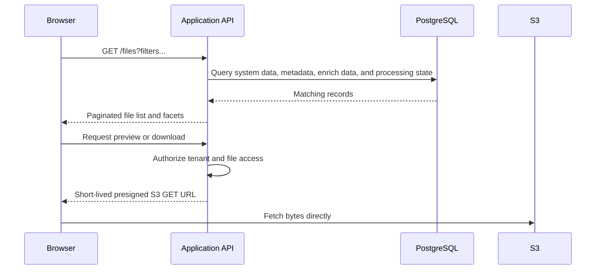

# Terabyte-Scale Uploader Application

---

## Overview

This file describes a design for a **terabyte-scale uploader application** that conforms to the requirements described in @ASSIGNMENT.md.

## Goals

- Reliably and efficiently upload huge amounts of data for the lowest cost possible
- Allow effective resume if something goes wrong so progress is not lost
- Extract metadata from diverse file types
- Decouple upload and extraction processes
- Store the data in a way that can be easily browsed in a UI
- Provide a UI that makes it easy to upload and browse files
- Provide an optional CLI upload tool for places where the browser is impractical
- Route the actual uploads directly to the S3 bucket using pre-signed URLs to spare our infra

## Glossary

- **System data:** `name`, `type`, `size`, and other common properties of all files
- **Metadata:** data entered by the user; available fields can differ by file type
- **Enrich data:** values extracted or generated automatically by the processing pipeline, including deterministic technical metadata and optional LLM-produced values
- **Transaction:** a group of operations that must happen atomically or be rolled back; this does not necessarily mean a single database transaction

## System components/technologies

| Name                   | Technology                                      | Description                                                                       |
| ---------------------- | ----------------------------------------------- | --------------------------------------------------------------------------------- |
| Browser client         | React                                           | Web UI for selecting files, entering metadata, uploading, and browsing            |
| CLI client             | Go                                              | Optional upload tool for large local trees where the browser is impractical       |
| Object storage         | S3 / S3-compatible                              | Durable storage for file bytes; clients upload chunks via presigned URLs          |
| Upload API server      | Node.js + TypeScript + Prisma                   | Control plane for batches, multipart uploads, and progress; issues presigned URLs |
| Database               | Postgres (pgvector, PostGIS)                    | System data, user metadata, enrich data, upload state, and search indexes         |
| Queue                  | SQS                                             | Managed, durable queues drive the event-driven handoff from upload completion to asynchronous processing |
| Pipeline               | Node.js workers consuming stage-specific queues | Extracts technical metadata, content, chunks, embeddings, and optional clustering |
| Cleanup job            | Scheduled worker                                | Aborts stale multipart uploads and removes orphaned or expired state              |
| Application API server | Node.js + TypeScript + Prisma                   | Backend for the frontend browse and metadata views                                |

A dedicated search cluster, Kafka, Redis, Kubernetes, or a specialized vector database can be introduced if future scale demonstrates the need, but they are not required for the initial system.

Only the client-to-S3 paths carry original file bytes. The APIs are stateless control-plane services and can scale independently.

### Why these technologies

- **React** is a mature TypeScript UI stack suited to long-lived upload state, metadata forms, progress reporting, and browse views. Upload state is managed outside the component tree and persisted in IndexedDB.
- **Go for the CLI** produces a small standalone binary and is well suited to long-running concurrent uploads and directory traversal.
- **Node.js, TypeScript, and Prisma** provide asynchronous I/O, shared types across the web client and APIs, typed database access, and migrations.
- **S3** provides durable managed object storage, multipart upload, presigned URLs, event notifications, and lifecycle policies without operating a storage cluster.
- **PostgreSQL** combines relational indexing, JSONB, full-text search, and transactions. `pgvector` supports semantic search alongside relational filters, and PostGIS supports geospatial queries over EXIF and radar coordinates.
- **SQS** provides managed at-least-once delivery, visibility timeouts, retries, and dead-letter queues, driving an event-driven pipeline where each stage's completion triggers the next. The pipeline needs a work queue rather than Kafka's replayable event log.
- **Independent workers** let extraction stages scale according to their different CPU, memory, GPU, and external-rate-limit needs.

### Key technical decisions

- **Direct-to-S3 upload:** removes application servers from the binary data path, the primary scaling decision for multi-terabyte uploads.
- **Multipart upload:** enables parallel transfer, chunk-level retry, and resume without retransmitting an entire file.
- **Bounded client-side concurrency:** increases throughput without overwhelming the browser, network, or S3; chunks from multiple files are interleaved fairly.
- **Batch presigning:** generates short-lived URLs just before use, bounds API payloads, and allows authorization to be revalidated.
- **S3 as upload source of truth:** client and database progress improve UX, but S3 determines which parts were durably persisted.
- **Event-driven, asynchronous processing:** upload completion never waits for enrichment, and new file types require new processors rather than changes to the upload path.
- **PostgreSQL-first search:** structured filters, JSONB, full-text search, vectors, and geospatial queries initially remain in one consistency boundary. Specialized search infrastructure is introduced only when measured scale requires it.
- **Separate Upload and Application APIs:** a bursty ingest cannot starve latency-sensitive browse traffic; they may initially run in one process while retaining separate contracts.

## Config parameters

- `MAX_CHUNK_SIZE` — upper bound for a multipart chunk; actual size scales with file size to remain below S3's part-count limit.
- `MAX_UPLOAD_CONCURRENCY` — maximum number of chunk uploads in flight per client, shared across that client's files.
- `PRESIGNED_URL_BATCH_SIZE` — maximum chunks in one presigning request, bounding payload size and URL staleness.

## High-level flow

- Client upload process
- S3 emits event
- Add to queue
- Processing / enrichment pipeline
  - classification
  - technical metadata extraction
  - text/content extraction (including geolocation)
  - chunking, embedding, clustering
- Browse, filter, search, preview, and download

## Upload reliability design

### Client upload manager

The browser and CLI use the same upload protocol. A dedicated `UploadManager`, independent of the React component tree, owns:

- pending, active, completed, and failed chunk queues
- completed chunk ETags and retry counters
- bounded concurrency shared fairly across all files in the local batch
- pause, resume, cancel, and retry behavior
- local recovery state and progress notifications for the UI

The browser persists recovery state in IndexedDB; the CLI persists equivalent state on disk. This includes the batch and file IDs, multipart upload IDs, chunk size, completed chunk IDs, and ETags.

### Multipart chunk sizing

S3 limits the number of parts in a multipart upload, so chunk size is derived from file size rather than fixed:

```text
chunkSize = min(
  MAX_CHUNK_SIZE,
  max(DEFAULT_CHUNK_SIZE, ceil(fileSize / SAFE_MAX_PART_COUNT))
)
```

`SAFE_MAX_PART_COUNT` remains below S3's hard limit to leave operational headroom. Typical chunks are tens to hundreds of MB. Presigned URLs are requested in small batches shortly before use so they do not expire while waiting in a very large transfer.

### Chunk retry, progress, and resume

Each chunk uploads directly to S3 and returns an ETag. A failed chunk is retried independently using exponential backoff with jitter; successfully uploaded chunks are not resent.

The client owns transient progress and periodically sends aggregated completed-part records to the API. This avoids a database write for every chunk. S3 remains authoritative: after a crash or lost progress update, the API calls `ListParts`, reconciles persisted parts with local state, and only missing chunks are uploaded again.

All retryable operations are idempotent:

- The client supplies a stable `uploadBatchIdempotencyKey`; a repeated batch request returns the existing batch.
- Every file has a stable `fileIdempotencyKey`, so retrying a registration request returns the same logical file. Cross-batch content deduplication uses a checksum when one is available; name, type, and size alone are not sufficient proof that bytes are identical.
- Uploading the same S3 part number replaces that part.
- Completion tolerates duplicate requests without creating another logical file.
- Pipeline workers are idempotent on `(fileId, stage)`.

### Completion and abandoned uploads

When all ETags are known, the API calls `CompleteMultipartUpload`; the assembled object, not its transport chunks, becomes the pipeline input. A reconciliation worker handles clients that uploaded their final parts but died before the last progress report.

Incomplete multipart uploads consume storage, so two controls apply:

1. A scheduled cleanup worker finds stale `UPLOADING` rows, reconciles them with S3, completes uploads whose parts are all present, and aborts expired incomplete uploads.
2. An S3 lifecycle rule aborts multipart uploads older than a configured period if the application cleanup path fails.

### File status

`File.status` is a `FileStatus` enum representing the user-visible lifecycle of one logical file across upload and enrichment:

- `CREATED` — the `File` row exists, but multipart upload has not started.
- `UPLOADING` — at least one multipart upload is active or resumable.
- `UPLOADED` — S3 contains the completed immutable object; pipeline handoff is pending.
- `CLASSIFYING` — the pipeline is determining the actual format and extractor family.
- `EXTRACTING_METADATA` — deterministic technical metadata is being extracted.
- `EXTRACTING_CONTENT` — text, OCR, transcription, previews, summaries, topics, or tags are being produced.
- `CHUNKING` — extracted content is being split into stable retrieval chunks.
- `EMBEDDING` — vectors are being generated and stored for semantic search.
- `READY` — all required processing stages for this file type completed. Optional offline work such as clustering may still run.
- `PARTIALLY_READY` — the original is browsable and downloadable and available enrichment is retained, but one or more non-critical enrichment stages permanently failed.
- `UPLOAD_FAILED` — upload cannot continue without an explicit retry or a new upload.
- `PROCESSING_FAILED` — a critical stage, such as classification, permanently failed, so the pipeline cannot determine a valid downstream route.
- `EXPIRED` — an incomplete upload exceeded its retention window and its multipart parts were aborted.

The normal path is:

```text
CREATED
  → UPLOADING
  → UPLOADED
  → CLASSIFYING
  → EXTRACTING_METADATA
  → EXTRACTING_CONTENT
  → CHUNKING
  → EMBEDDING
  → READY
```

Stages that do not apply to a file type are skipped. For example, an image with no extractable text can move from `EXTRACTING_CONTENT` directly to `READY`; it does not need empty chunks or embeddings. Optional clustering is deliberately absent from `FileStatus` because it runs after a file is ready and must not block availability.

`File.status` is a convenient, indexed projection for the UI and common queries; it is not the pipeline's retry ledger. `FileProcessingJob` retains the authoritative per-stage `<STAGE>_PENDING → <STAGE>_RUNNING → <STAGE>_DONE` state, attempts, errors, and timestamps. A worker updates its stage record and the corresponding `File.status` in the same database transaction. Retried or replayed enrichment may move a file from `PARTIALLY_READY` or `PROCESSING_FAILED` back into the relevant active state.

## Data Models

This is a simplified schema of what we would have in PostgreSQL.

Example model:

```text
File
-------------------------
id
tenantId
fileIdempotencyKey
name
type
size
storageKey
contentHash  -- optional; enables safe cross-batch deduplication
status FileStatus  -- indexed user-visible upload and processing lifecycle
createdAt
updatedAt

location GEOGRAPHY(Point)  -- PostGIS geolocation extracted during enrichment

metadata JSONB
enrichData JSONB
```

Upload batches and in-flight file uploads are stored separately:

```text
UploadBatch
-------------------------
id
idempotencyKey
status
createdAt

UploadFile
-------------------------
id
fileId
uploadBatchId
fileIdempotencyKey
s3UploadId
chunkSize
status
createdAt
lastActivityAt
```

Extracted text and embeddings are stored per content chunk rather than on the `File` row:

```text
ContentChunk
-------------------------
id
fileId
sequence
content
contentType
sourceOffset
embedding VECTOR(N)
embeddingModel
```

Common searchable attributes such as:

- tenant
- type
- status
- size
- upload date

are stored as normal columns and explicitly indexed.

File-type-specific metadata and enrich data remain in JSONB for extensibility.

This avoids schema migrations every time support for a new file format is added.


## Application flow

### 1. Upload process

This process is identical for both the browser and CLI tools. They both talk to the **Upload API Server** through the same endpoints. The API stores upload metadata and state in PostgreSQL, while S3 is the source of truth for uploaded bytes. After a file is uploaded, it is handed off to the **file processing pipeline** asynchronously.

- User selects files
- Client gives the user the option to enter metadata according to each file type, using predefined fields and defaults
- Client determines chunk size < `MAX_CHUNK_SIZE` and the amount of concurrent uploads < `MAX_UPLOAD_CONCURRENCY`
- Client creates stable batch and file idempotency keys for the request, then calls `POST /upload-batch` with system data, user metadata, optional checksums, and those keys
  - API creates an `UploadBatch` row in the DB
  - API creates a `File` row _for each_ file in the DB
  - If either idempotency key already exists, the API returns the corresponding existing record
  - Within the same tenant, a matching trusted content hash returns the existing completed `File` with `deduplicated: true`; the client skips multipart upload for that file
  - Returns the `uploadBatchId`, `uploadBatchIdempotencyKey`, and each file's `fileId`, `fileIdempotencyKey`, and `deduplicated` status
- Client sends `POST /upload-batch/:uploadBatchId/presign` for each sub-batch of chunks (up to `PRESIGNED_URL_BATCH_SIZE`) to API (this selects N chunks and gets signed URLs for them)
  - --- Start transaction ---
  - API calls `CreateMultipartUpload()` on S3 for each file (if not exists, can contain chunks from previous sub-batch), which returns `uploadId`
  - API inserts a row for each `UploadFile` in PostgreSQL with `uploadId`, `uploadBatchId`, and `fileIdempotencyKey` as identifiers, as well as its own primary key
  - API calls S3 to generate presigned upload URLs for each `chunkId` per `uploadId`
  - ---- End transaction ---
  - API returns JSON payload with `fileId`, `chunkId`, `signedUrl`, `uploadId` _for each chunk_
- Client uploads files by chunk to the S3 signed URLs up to `MAX_UPLOAD_CONCURRENCY`
  - Client sends periodic batch updates to `PATCH /upload-batch/:uploadBatchId` of the progress of the currently uploading chunks, until all chunks are uploaded
  - Chunks can be re-queued and retried if there is an interruption
  - Request retries are recognized through `fileIdempotencyKey`; optional content checksums support safe deduplication across batches

### 2. Handoff: upload → pipeline

This is the seam between the two halves of the system, and it is the one place where a lost message would mean a file is stored but never enriched. So it is made transactional.

- On object completion, **S3 emits an event** to a queue. S3 is the source of truth for "the bytes exist" — deriving the trigger from storage itself, rather than from the client or the API, means we can never enqueue processing for an object that isn't really there
- A **transactional outbox** lambda consumes the event
- --- Start transaction ---
- Lambda inserts a `FileProcessingJob` row with status `CLASSIFICATION_PENDING`, the first state of the pipeline
- Lambda inserts the corresponding outbox record for the `ClassificationQueue`
- ---- End transaction ---
- A relay publishes committed outbox records to the queue and marks them sent, so the job row and the intent to enqueue commit or fail together — we can never end up with a job row nobody works on, or a queue message with no job row
- The relay may publish a message twice, which is fine — every stage below is idempotent on `(fileId, stage)`
- The S3 event consumption and the job insert are both keyed on the object, so redelivery of the same S3 event is a no-op

### 3. Processing / enrichment pipeline

Each stage is an independent worker: it consumes from its own queue, does one job, writes its output, advances `FileProcessingJob`, and enqueues the next stage. Stages share no state beyond the database and S3. `FileProcessingJob` is the state machine and the single place to answer "what happened to this file" — each stage moves through `<STAGE>_PENDING → <STAGE>_RUNNING → <STAGE>_DONE`, with `attempts`, `lastError` and timestamps recorded. Terminal states are `READY` (fully enriched and browsable) and `FAILED`.

- **Classification** — confirm what the file actually is, from magic bytes and a sampled read rather than trusting the client-supplied extension, and route it to the right extractor family (document, image, video, radar, unknown)
  - Everything downstream depends on getting this right, which is why it is first and separate
- **Technical metadata extraction** — format-specific tooling reads the file's own headers: `ffprobe` for audio/video (codec, duration, resolution, bitrate), `exiftool` for images (camera, GPS, capture time), Tika/PDF tooling for documents (page count, author, producer), and dedicated parsers for domain formats such as radar files (sweep geometry, sensor parameters, acquisition window)
  - Cheap, deterministic, no LLM; intentionally the first _enrichment_ stage so a file becomes browsable-with-real-attributes quickly, even if the expensive stages behind it are still queued or have failed
  - Output: structured `enrich data` on the `File`
- **Text / content extraction** — pull out human-readable content: text layers from documents, OCR from scanned pages and images, transcription from audio/video, keyframes from video, and derived previews and thumbnails
  - Extracted artifacts are written back to S3 as derivatives alongside the original, never in the database — the DB stores pointers
  - This is also where LLM-based enrichment happens: summaries, topics and tags for files whose content is otherwise opaque to a metadata field
- **Chunking** — split extracted content into retrieval-sized, overlapping chunks with stable offsets back into the source, so a search hit can point at _where_ in a 400-page PDF or a 2-hour video the match was
- **Embeddings** — embed each chunk and store the vectors in Postgres via `pgvector`, next to the relational metadata, so semantic search can be combined with `type = video AND mission = X` in a single query, instead of joining across two systems
  - Batched, and the stage most likely to be rate-limited or slow, which is precisely why it sits behind its own queue with its own concurrency
- **Optional clustering** — periodically group semantically related files to power "similar files" and automatic collections
  - Offline and non-blocking: it runs over already-embedded files, so it can never hold up a file becoming browsable

### 4. Failure handling in the pipeline:

- **Transient failures** (rate limits, timeouts, a worker being evicted) are retried with exponential backoff via queue redelivery
- **Permanent failures** (a corrupt file no parser can read, an unsupported format) exhaust their retries and move to a **dead-letter queue**, with `lastError` recorded on the job
- **Failures are contained per stage** — a file whose transcription fails still keeps its technical metadata and stays browsable, simply marked as partially enriched; users never lose access to data because an enrichment step failed
- **Every stage is idempotent and replayable** — because the original bytes are immutable in S3 and stage state is explicit, we can re-drive one stage for one file or backfill a whole corpus after improving a model or fixing a parser bug, without re-uploading anything

### 5. Browse, search, preview, and download

The browse UI queries logical `File` records through the Application API; it never lists S3 directly.



Browse supports:

- faceted filters over type, size, upload date, owner, status, user metadata, and technical enrich data
- logical organization through projects, folders, tags, and metadata
- keyword search over names and extracted text
- optional semantic search over extracted chunks
- file details showing the original system data, user metadata, technical enrich data, processing status, and available previews
- direct download and preview through authorized short-lived S3 URLs

Frequently queried fields use normal PostgreSQL columns and B-tree indexes. File-type-specific fields remain in JSONB with GIN indexes where useful. Extracted text uses PostgreSQL full-text search initially. `pgvector` stores chunk embeddings beside relational metadata, allowing queries such as “semantically similar PDFs in project Apollo” in one database.

If measured search traffic later requires independent scaling, advanced faceting, ranking, or typo tolerance, OpenSearch can be introduced without changing the upload or processing architecture.

## User interface design

The UI artifact should contain two primary pages.

### Upload page

- file and directory selection with drag-and-drop
- batch-level metadata forms grouped by detected file type, with defaults and per-file overrides
- validation before bytes are transferred
- overall and per-file progress, current speed, remaining bytes, and processing status
- pause, resume, cancel, and retry controls
- explicit partial-failure states so one failed file or chunk does not hide successful uploads
- recovery of interrupted browser uploads from IndexedDB

### Browse page

- search input plus faceted filters for type, date, size, status, tags, projects, and type-specific metadata
- list/grid results with preview, key metadata, enrichment status, and pagination
- file detail view with preview, user metadata, technical enrich data, extracted content matches, and processing errors
- actions for download, metadata editing, retrying failed enrichment, and finding similar files

These page designs should be captured as UI sketches in the repository; they do not need functional implementation for this assignment.

## Security

- Clients receive no permanent cloud credentials. Presigned URLs are short-lived, operation-specific, and scoped to a single bucket, object key, multipart upload, and part number.
- Every API operation and URL-signing request checks tenant and file authorization.
- Original object keys are immutable application identifiers such as `files/{tenantId}/{fileId}/original`; user filenames remain in PostgreSQL.
- TLS protects data in transit and server-side encryption protects S3 objects and database storage at rest.
- Metadata is validated server-side. Audit logging records upload, metadata mutation, download, and administrative reprocessing operations.
- Processing workers treat files as untrusted input: parsers run with least privilege, restricted outbound access, bounded scratch storage, and per-file timeouts. Malware scanning can be added as the first processing stage.

### Privacy and LLM data handling

LLM-based enrichment (summaries, topics, tags in the text/content extraction stage) is the one point in the system where file content is sent to a third party, so it is treated as a distinct trust boundary rather than an implementation detail of that stage:

- **Minimize what crosses the boundary.** The LLM only ever receives already-extracted text derivatives — never original bytes — and only as much of it as the prompt needs, not a whole document dumped in "just in case."
- **Per-tenant opt-out.** LLM enrichment is an optional pipeline stage, same as clustering: a tenant or file flag (`llmEnrichmentDisabled`) skips it entirely, and the file proceeds straight to `READY`/`PARTIALLY_READY` with its deterministic enrich data intact. Tenants handling sensitive or classified content (e.g. radar/mission data) can disable it globally.
- **Redact before sending.** A lightweight PII/sensitive-data scrub (regex for emails, IDs, credentials; optionally NER) runs on extracted text before it is handed to the LLM, as its own idempotent sub-step.
- **Vendor and deployment choice.** Preferred providers offer contractual zero-retention / no-training-on-input guarantees. For the most sensitive tenants, LLM calls can be routed to a self-hosted open-weight model running inside our own VPC instead of a third-party API — same worker interface, different endpoint, selected per tenant.
- **Bounded network egress.** Extraction workers are restricted, by enforced network policy (not just convention), to S3 and the configured model endpoint — nothing else. This is the control that actually limits exfiltration if a worker is compromised.
- **Audit without duplicating content.** Every LLM call is logged (tenant, `fileId`, stage, model, token count, timestamp) alongside the existing upload/download/reprocessing audit trail, so "was this file ever sent to an external LLM, and when" is answerable without storing the content a second time in logs.
- **Deletion propagates.** Deleting a file or tenant removes LLM-derived `enrichData` along with everything else, and provider agreements are expected to guarantee deletion/no-retention on their side too.

## Scaling and operations

Each layer scales according to its own pressure:

- Upload and Application API instances scale by control-request and browse traffic.
- S3 absorbs upload/download bytes and storage growth.
- Each processing stage scales independently by queue depth and processing latency.
- PostgreSQL uses connection pooling, read replicas for browse traffic, backups, and point-in-time recovery.
- Queue backlogs absorb worker or database outages without losing uploaded files.

Operational metrics include upload throughput and failure rate, stale multipart count and age, queue depth and oldest-message age per stage, processing duration and retry count, DLQ size, database latency, and S3 storage growth.

## Where data lives at each stage

| Stage            | File bytes                                           | Metadata and state                                                                      |
| ---------------- | ---------------------------------------------------- | --------------------------------------------------------------------------------------- |
| Selection        | Client disk                                          | Client memory                                                                           |
| Batch registered | Client disk                                          | `UploadBatch` and `File` in PostgreSQL; user metadata is already durable                |
| Uploading        | S3 multipart parts                                   | `UploadFile`, chunk progress, and heartbeat in PostgreSQL; recovery state on the client |
| Uploaded         | Immutable S3 object                                  | `File` marked `UPLOADED` in PostgreSQL                                                  |
| Handoff          | S3 object                                            | `FileProcessingJob`, outbox row, and queue message                                      |
| Processing       | S3 original plus generated derivatives               | Enrich data and stage state in PostgreSQL                                               |
| Ready            | S3 original and previews/derivatives                 | Searchable metadata, extracted chunks, vectors, and status in PostgreSQL                |
| Browse/download  | Bytes flow directly from S3 to the authorized client | Application API queries PostgreSQL and issues a short-lived S3 URL                      |
