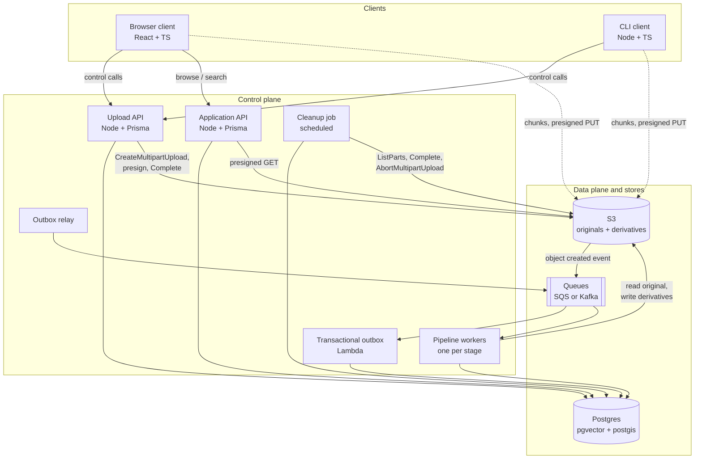

# Infrastructure

`ARCHITECTURE.md` describes *what happens* to a file, end to end. This document describes *what is actually deployed* to make that happen: every component, the technology it runs on, the state it owns, who it is allowed to talk to, and what makes it fall over.

The system splits into a **control plane** (small, stateless, scales with users and operations) and a **data plane** (S3, scales with bytes). No component in the control plane ever has file bytes flowing through it — that single constraint is what lets a handful of API containers serve tens of TB of upload traffic.

---

## Component map



Dotted lines are the only paths that carry file bytes.

---

## Inventory

| Component | Technology | Stateful | Scales with |
| --- | --- | --- | --- |
| Browser client | React + TypeScript (SPA, not Next.js) | Local only (IndexedDB) | — |
| CLI client | Node.js + TypeScript, single binary | Local only (state file) | — |
| Upload API | Node.js + TypeScript + Prisma | No | Control requests/sec, not bytes |
| Application API | Node.js + TypeScript + Prisma | No | Browse and search traffic |
| Object storage | S3 (or S3-compatible: MinIO, R2, Ceph) | Yes — the bytes | Total stored bytes |
| Database | Postgres + `pgvector` + `postgis` | Yes — everything else | File count, chunk count |
| Queues | SQS (default) or Kafka | Transient | Pipeline backlog |
| Transactional outbox | Lambda / small consumer | No | S3 event rate |
| Pipeline workers | Containers, one deployment per stage | No | Queue depth per stage |
| Cleanup job | Scheduled container / cron | No | In-flight upload count |

---

## Clients

### Browser client — React + TypeScript

A plain React SPA rather than Next.js. There is no SEO surface and no server-rendering requirement here; what the upload page actually needs is a long-lived client-side process that survives navigation within the app, and adding a Node rendering tier would only add a component with nothing to do.

The upload logic lives in an `UploadManager` that is deliberately independent of the React tree — it owns the pending/active/completed chunk queues, retry counters, collected `ETag`s and bounded concurrency, and it publishes progress that components subscribe to. Recovery state is persisted to IndexedDB, so a browser crash or a closed tab resumes rather than restarts.

Browser-specific limits shape the defaults: memory pressure caps how many chunks can be buffered at once, and the browser's per-origin connection limit caps useful concurrency well below what the CLI can sustain.

### CLI client — Node.js + TypeScript

The same upload protocol, built for the case the browser genuinely cannot serve: walking a directory tree of tens of TB, running for days, surviving being backgrounded over SSH, and using the machine's full NIC. It persists its resume state to a local file and re-presigns whatever it had not finished when it restarts.

Both clients are untrusted. They hold no cloud credentials — only a session token for the APIs and short-lived presigned URLs scoped to a single bucket, key, `uploadId` and part number.

---

## Upload API — Node.js + Prisma

The control plane for the upload path, and the only component permitted to mint presigned upload URLs. It serves `POST /upload-batch`, `POST /upload-batch/:id/presign` and `PATCH /upload-batch/:id`, and it owns:

- authorization of every upload operation, before any URL is signed;
- the `UploadBatch`, `File` and `UploadFile` rows, and idempotent resolution of `uploadBatchIdempotencyKey` / `fileIdempotencyKey`;
- calls to S3 for `CreateMultipartUpload`, `UploadPart` presigning and `CompleteMultipartUpload`.

It is stateless and horizontally scaled behind a load balancer. Its capacity is a function of how many *control* calls arrive, and batched presigning is what keeps that number small: one request covers up to `PRESIGNED_URL_BATCH_SIZE` chunks, and progress reporting is batched rather than per-chunk, so a million-chunk batch does not become a million requests.

Prisma is used for the schema, migrations and typed access shared with the Application API. The heavier read queries behind browse and search drop to raw SQL where the query planner needs help.

### Why it is separate from the Application API

They share a database and a Prisma schema but deploy separately, because their load profiles have nothing in common: the Upload API is bursty and driven by a small number of clients moving enormous volumes, while the Application API is steady, user-facing and latency-sensitive. Splitting them means a 40 TB ingest cannot starve the browse page, and each can be scaled and rate-limited on its own terms. For a small deployment they can start as one process behind two routes and be split later without changing the contract.

---

## Application API — Node.js + Prisma

The read plane for the frontend: faceted browse and filtering over system data, user metadata and enrich data; keyword and semantic search over extracted chunks; file detail views including live pipeline status; and short-lived presigned `GET` URLs for downloads and previews.

Downloads mirror uploads exactly — the API authorizes and signs, and the bytes flow directly between S3 and the client.

---

## Object storage — S3

The data plane and the source of truth for file bytes. Objects live under an application-generated immutable key rather than the user's filename:

```text
files/{tenantId}/{fileId}/original
files/{tenantId}/{fileId}/derivatives/{kind}/{name}
```

Duplicate filenames are therefore harmless, renaming a logical file touches only Postgres, and authorization can key off application IDs.

Configuration that matters:

- **Multipart upload** is the mechanism behind the entire resumable upload design. Its 10 000-part ceiling is what forces chunk size to scale with file size rather than being a fixed constant.
- **Event notifications** on object creation feed the pipeline queue. Deriving the trigger from storage rather than from the client means processing can never be enqueued for an object that does not exist.
- **A lifecycle rule aborting incomplete multipart uploads** after a fixed window is the backstop beneath the cleanup job, so orphaned parts cannot silently accrue cost.
- **CORS** on the bucket, since browsers `PUT` to it directly.
- Server-side encryption at rest; TLS in transit.

Any S3-compatible store works — the system uses only multipart upload, presigning, events and lifecycle rules, all of which MinIO, R2 and Ceph implement. That keeps local development and on-prem deployment honest rather than mocked.

---

## Database — Postgres

One store for all state that is not bytes: `UploadBatch`, `File`, `UploadFile`, `FileProcessingJob`, extracted chunks and their embeddings.

Two extensions carry real weight:

- **`pgvector`** holds chunk embeddings next to the relational metadata. Keeping vectors in the same database as the filters is the whole point — `type = 'video' AND mission = 'X'` combined with vector similarity is one query with one consistency model, instead of a join across a separate vector database that can drift out of sync with the file table.
- **`postgis`** indexes geospatial extents extracted from radar files and image EXIF GPS, which makes "everything captured over this area" a real query rather than a scan.

The schema keeps common searchable attributes (tenant, type, status, size, upload date) as indexed columns and file-type-specific metadata and enrich data in `JSONB`, so supporting a new format is a new processor rather than a migration.

Operationally this is a managed instance with read replicas for browse and search traffic, PITR backups, and connection pooling in front of it — the pipeline workers scale out on queue depth and would otherwise exhaust connection slots long before they exhaust CPU.

---

## Queues — SQS or Kafka

One queue per pipeline stage rather than one shared queue, so each stage has independent concurrency, independent backlog and an independent failure surface. The embedding stage being rate-limited by a model provider must not stall classification.

Every queue has a **dead-letter queue** attached, and delivery is at-least-once — every consumer is idempotent on `(fileId, stage)`, so redelivery is a no-op rather than duplicated work.

**SQS is the default.** It is fully managed, has no cluster to operate, and gives DLQs, visibility timeouts and redrive out of the box. The pipeline needs a work queue, not an event log: each message is consumed once by one worker, and there are no independent consumer groups replaying the same stream.

**Kafka earns its operational cost only if** we later want multiple independent consumers over the same event stream, replay from an offset, or ordering guarantees per partition key. Retention and replay for reprocessing are already covered a different way: the original bytes are immutable in S3 and stage state is explicit in `FileProcessingJob`, so a stage can be re-driven for one file or backfilled across the corpus by re-enqueueing from the database.

---

## Transactional outbox — Lambda

A small consumer of S3 object-created events sitting at the seam between upload and pipeline, which is the one place where a lost message would leave a file stored forever but never enriched.

Per event, in a single database transaction, it inserts the `FileProcessingJob` row at `CLASSIFICATION_PENDING` and the matching outbox record. A **relay** then publishes committed outbox records to the classification queue and marks them sent. The job row and the intent to enqueue commit or fail together, so there is never a job row nobody works on, nor a queue message with no job row.

Lambda fits because the workload is event-shaped, bursty and tiny per invocation. It is the one component with no steady-state cost.

---

## Pipeline workers

One deployment per stage — classification, technical metadata, text/content extraction, chunking, embeddings, and offline clustering — each consuming its own queue, writing its output, advancing `FileProcessingJob`, and enqueueing the next stage. Stages share nothing but Postgres and S3.

Separate deployments because their resource profiles are genuinely different, and a single worker image would have to be provisioned for the worst case of all of them:

| Stage | Bound by | Notes |
| --- | --- | --- |
| Classification | I/O | Reads magic bytes and a sample; tiny and fast |
| Technical metadata | CPU | Bundles `ffprobe`, `exiftool`, Tika, radar parsers |
| Text / content extraction | CPU, sometimes GPU | OCR and transcription; the heaviest stage |
| Chunking | CPU | Cheap, pure transformation |
| Embeddings | External rate limits | Batched; its own low concurrency |
| Clustering | Scheduled batch | Runs over already-embedded files, never blocking |

They run as containers on ECS Fargate or Kubernetes, autoscaled on queue depth to zero when idle. Extraction workers need scratch disk sized to the largest file they must open, and they stream from S3 rather than buffering whole objects wherever the tool allows it.

The extraction stage is also the widest attack surface in the system — it runs third-party parsers over untrusted user-supplied files. Those workers run with no database write path beyond their own results, no outbound network beyond S3 and the model provider, and a hard timeout per file.

The "model provider" egress is deliberately narrow: a security-group / NetworkPolicy allow-list, not just an application-level convention, so a compromised extraction worker cannot exfiltrate data anywhere else. Which provider that allow-list points to is a per-tenant choice — a shared third-party LLM API with a contractual zero-retention / no-training guarantee for most tenants, or a self-hosted model endpoint inside our own VPC for tenants whose data (e.g. radar/mission files) must never leave our infrastructure. See [Privacy and LLM data handling](./ARCHITECTURE.md#privacy-and-llm-data-handling) in `ARCHITECTURE.md` for the full policy.

---

## Cleanup job

A scheduled job covering everything that fails by *not happening*:

- **Upload reconciliation.** For `UploadFile` rows that are stale but incomplete — the client died before its final `PATCH` — it calls S3 `ListParts` to learn the truth, completes uploads that actually finished, and marks the rest for retry.
- **Abandoned multipart uploads.** Past a deadline it issues `AbortMultipartUpload`, so parts of a half-uploaded 2 TB file are not billed indefinitely. The S3 lifecycle rule is the backstop if this job itself is broken.
- **Stuck pipeline jobs.** `FileProcessingJob` rows left `*_RUNNING` past a stage timeout (a worker evicted mid-job) are returned to `*_PENDING` and re-enqueued.
- **Orphaned objects.** Objects in S3 with no corresponding `File` row, and derivatives whose parent was deleted.

It is idempotent, it holds no state of its own, and everything it does could also be triggered manually for a single file during an incident.

---

## Configuration

The constants that govern upload behaviour are server-supplied rather than hardcoded in clients, so they can be tuned without shipping a new CLI:

| Constant | Governs |
| --- | --- |
| `MAX_CHUNK_SIZE` | Upper bound on part size; actual size scales up with file size to stay under S3's 10 000-part limit |
| `MAX_UPLOAD_CONCURRENCY` | Parallel part uploads in flight per client |
| `PRESIGNED_URL_BATCH_SIZE` | Chunks per `presign` request, bounding both payload size and URL staleness |
| Presigned URL TTL | Short-lived; expiry is treated as an ordinary retryable failure |
| Stage timeouts and max attempts | When the cleanup job reclaims a job, and when it goes to the DLQ |

---

## Failure characteristics

| Component down | Effect | Recovery |
| --- | --- | --- |
| Upload API | No new batches or presigns; **in-flight chunks keep uploading** to already-signed URLs | Stateless restart; clients retry with backoff |
| Application API | Browse and download unavailable; uploads and pipeline unaffected | Stateless restart |
| Postgres | Control plane halts; S3 bytes and queued messages unaffected | Failover to replica; queues absorb the backlog |
| A queue | That stage backs up; earlier stages keep running | Messages are durable; workers drain the backlog |
| A pipeline worker | Files stall at that stage but stay browsable with whatever enrichment they already have | Autoscale or restart; in-flight jobs reclaimed by the cleanup job |
| Outbox relay | New uploads land in S3 and get job rows, but are not enqueued | Relay resumes from unsent outbox records — nothing is lost |
| S3 | Uploads and downloads stop | The one true hard dependency |

The pattern throughout: nothing is lost, work is only delayed, and no failure ever requires a user to upload bytes again.

---

## Monitoring and observability

Two different questions need answering, and they are answered by two different layers rather than one bolted-on monitoring stack:

**"Is the infrastructure healthy?" — CloudWatch.** SQS, Lambda and RDS already emit these metrics; nothing new needs to run to get them.

- Per-stage queue depth and `ApproximateAgeOfOldestMessage` — the earliest signal that a stage is falling behind its producers.
- DLQ size, alarmed at > 0 — a permanent failure landed and needs a human, by definition.
- Outbox Lambda: errors, duration, throttles.
- Postgres: connections, replica lag, CPU.

**"What is happening to the files?" — a dashboard over Postgres, not a new system.** `FileProcessingJob` is already the authoritative record of every file's stage, attempts and last error, so the dashboard is a read-only view over it rather than a second source of truth:

- Files per `FileStatus` and per stage, to see where the backlog actually is.
- Oldest `*_RUNNING` job per stage — the same query the cleanup job uses to reclaim stuck jobs, surfaced instead of just acted on.
- Error rate per stage from `lastError` / `attempts`, to catch a parser or model provider degrading before its DLQ fills up.

Grafana with a Postgres data source (and CloudWatch as a second data source) covers both in one place without introducing infrastructure that only exists to be monitored.

**Structured logs, correlated by `fileId` and `stage`.** Every API and worker log line carries `fileId`, `stage` and `tenantId` as structured fields, shipped to CloudWatch Logs. This answers "show me everything that happened to this one file" across every service without needing distributed tracing.

**Distributed tracing is deliberately deferred.** OpenTelemetry spans per stage, exported to X-Ray or Tempo, would answer "which stage is slow for this specific file" more precisely than logs and metrics — but it is the one piece here that is genuinely new infrastructure rather than a view over data that already exists. Worth adding if per-file latency debugging outgrows logs; not needed to ship the initial system.
